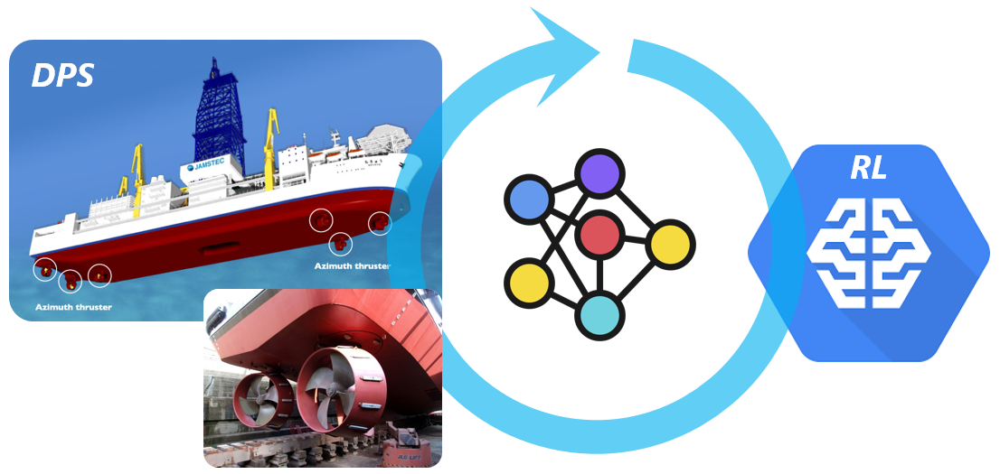

# Reinforcement Learning-Based Adaptive PID Controller for DPS

&nbsp;

## What is it?
Python code for implementation of the paper **'Reinforcement Learning-Based Adaptive PID Controller for DPS'**.

## Dependencies
Python libraries:
* numpy
* pandas
* tensorflow (version-2.3 is used in the paper)
* [OrcFxAPI](https://pypi.org/project/OrcFxAPI/)

Software:
* [OrcaFlex](https://www.orcina.com/orcaflex/) developed by Orcina (version-10.3 is used in the paper) [NOTE: its license is required to use the OrcaFlex]

## Installation
1. download [the *zip* file](https://github.com/danelee2601/RL-based-adaptive-PID-for-DPS/archive/master.zip) or do `git clone ...` and save in your directory
2. `pip install` all the libraries for the dependency
3. check if the OrcaFlex recognizes Python (otherwise, read an [OrcaFlex's documentation for Python API](https://www.orcina.com/webhelp/OrcFxAPI/Default.htm))
4. move the file `DP/dp_force_source/dp_force_windff.cp37-win_amd64.pyd` to the `Lib` directory where your python is installed

## Quick Start
#### Train the proposed controller
1. set `self.TEST = False` in `DP/DP_DDPG/settings.py`
2. open `DP/DP_DDPG/DDPG_based_DPS.dat`
3. run dynamic simulation
4. check the training results in `DP/results/train/reward_func_case1`
 *description for the results is documented in `DP/results/README.md`

#### Test the trained proposed controller
1. set `self.TEST = True` in `DP/DP_DDPG/settings.py`
2. open `DP/DP_DDPG/DDPG_based_DPS.dat`
3. run dynamic simulation
4. check the testing results in `DP/results/test/reward_func_case1`

#### Run a PID controller with the fixed base gain
1. open `DP/DP_ZN/ZN_based_DPS.dat`  ( ZN stands for Ziegler–Nichols )
2. run dynamic simulation
3. check the results in `DP/results/ZN/temp`

## Detailed Settings
#### Training
* environmental condition:
    in `DP/DDPG/DDPG_based_DPS.dat`, you can change the environmental condition. In the same way, the environmental condition for the testing can be set.

* hyper-parameters for the DDPG:
    the hyper-parameters are stated below '# params for ddpg' in `DP/DP_DDPG/settings.py`

* use of the fixed P, D base gains (= not to use the adaptive P, D gains):
    set `self.use_max_PD_gains = True` in `DP/DP_DDPG/settings.py`

* use of the fixed I base gains (= not to use the adaptive I gains):
    set `self.use_max_I_gain = True` in `DP/DP_DDPG/settings.py`

* use of the update-gates for the integral of the errors:
    set `self.use_gate_err_accumulation = True` in `DP/DP_DDPG/settings.py`

* neural network (NN) architecture:
    NN architecture with batch normalization: `DP/baselines/ddpg/ddpg_simple_bn_only.py`
    NN architecture without batch normalization: `DP/baselines/ddpg/ddpg_simple.py`
    *the above models can be switched by `self.use_bn` in `DP/DP_DDPG/settings.py`

#### PID controller with the fixed base gain
* environmental condition:
    in `DP/DP_ZN/ZN_based_DPS.dat`, you can change the environmental condition.

* fixed base gains:
    in `DP/DP_ZN/ZN_based_DPS.dat`, there is 'Vessel1' under a 'Vessels' directory. Under a tag named 'Tags' in the 'Vessel1', you can access 'ExternalFunctionParameters' where you can see the fixed base PID gains. ( If you change the fixed base gains in `DP/DP_ZN/ZN_based_DPS.dat`, you should change the `self.ZN_gains` in `DP/DP_DDPG/settings.py` accordingly. )
